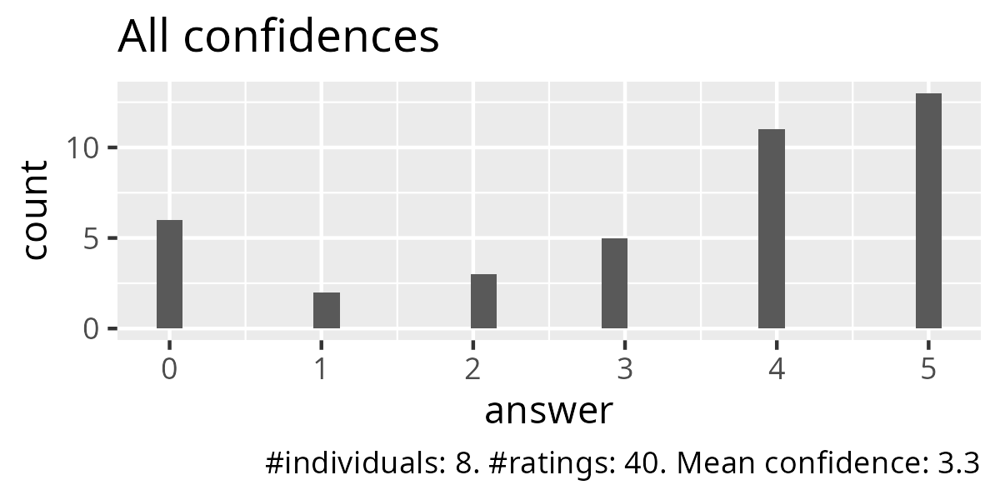
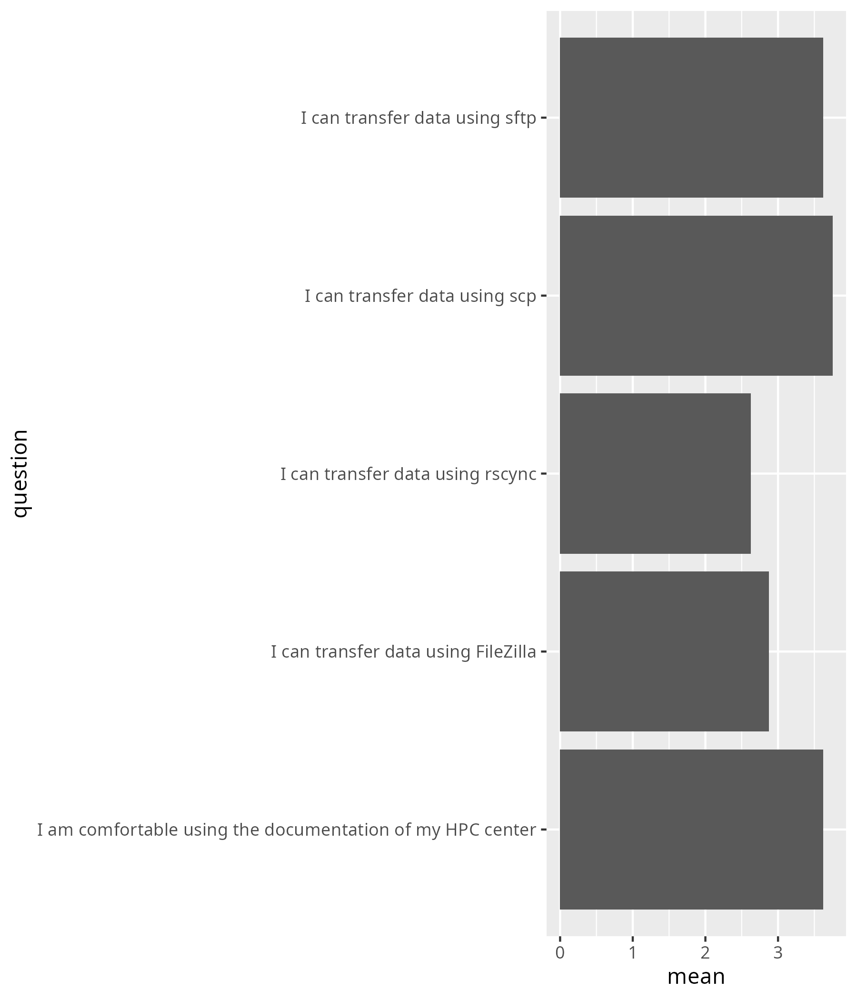

---
tags:
  - evaluation
  - result
  - 2025-03-07
  - 20250307
---

# Evaluation 2025-03-07

- Number of registrations: 37
- Number of active learners: 9 (24% show-up rate)
- Number of evaluations: 8 (89% response rate)
- Average confidence: 3.3 (out of 5)
- Success score (i.e. average confidence rescaled to 100%): 66%

## Anonymous feedback

- [anonymous_feedback.txt](anonymous_feedback.txt)

## Survey feedback

- [responses.csv](responses.csv)

## Analysis

- Script: [analyse.R](analyse.R)

The text answers from [responses.csv](responses.csv):

### Say something positive about Björn

- Kind and well listening
- Well prepared instructions, easy to follow!
- He helped us a lot when we had doubts
- Despite the late entry and technical problems he tried to get me up to
  speed quickly and put me in a group to feel comfortable.
- He is very patient teaching
- If a student is stuck, he understands quickly where the problem lies

### Say something about Björn he can improve

- Often refers to what is possible in theory,
  but then didn't actually explain how

### Say something positive about Richèl

- Clear communication, really wanted to help
- Very enthusiastic and motivating teacher
- He was very friendly and made the course very enjoyable to attend
- He was really interested in me being able to use rsync
  and made sure that I could connect to the cluster to be able to do
  the exercises despite not having access to the course cluster.
- He encourages learners to find ways to find the answer
- Very motivating, he keeps us awake without the coffee

### Say something about Richèl he can improve

- Doesn't always listen very well.
- Sometimes it is hard to guess what is the next thing to do.

### Any other feedback?

- It would be nice to start with scp and sftp so it's more likely
  you'll succeed with at least something, then getting stuck on
  filezilla and rsync for two hours and almost wanting to give up.
- I think as one of the prerequisites, all users should use same terminal
  type (like Ubuntu) and participants installed Ubuntu
  if they use windows prior to the course.
- I couldn't use rsync but I could use sftp and scp. FileZilla
  I didn't have time to try it but I will. Thank you very much!
- Add rsync to the requirements and steps on how to install it
- Thanks!
