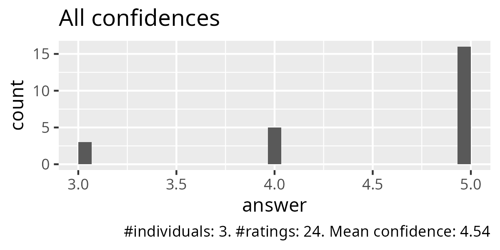
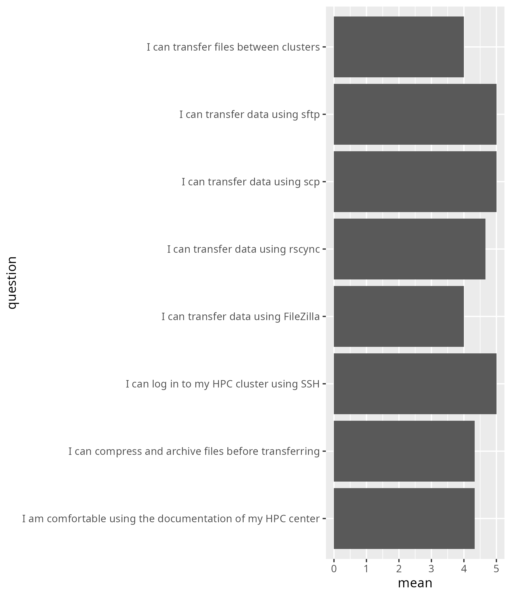
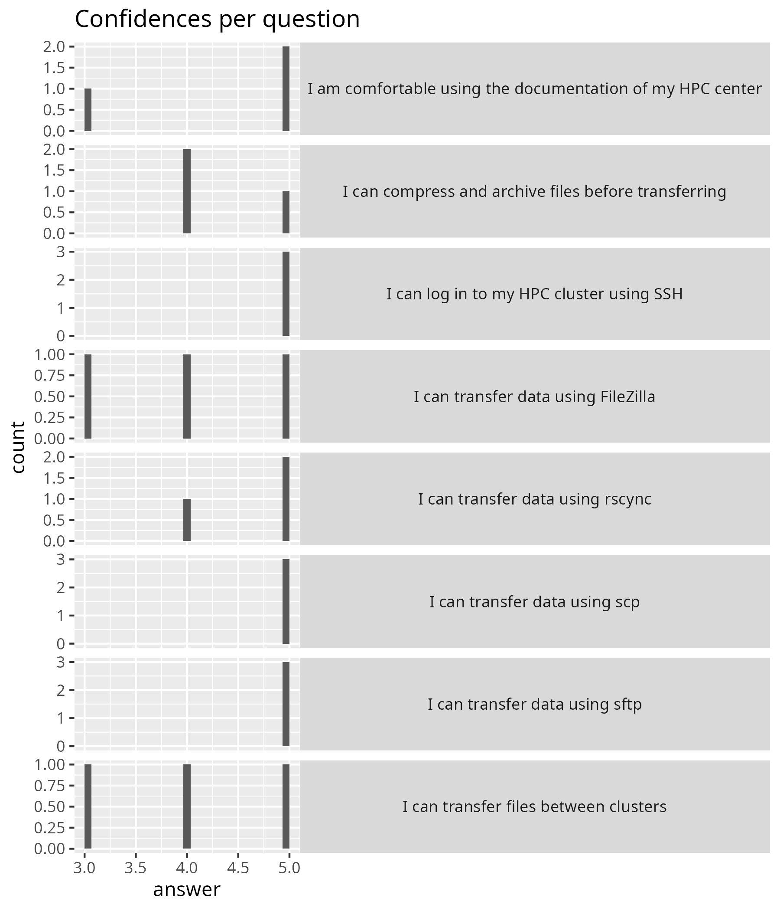

# Evaluation 2025-05-16

- Number of registrations: 15
- Number of learners present: 4 (27% show-up rate)
- Number of evaluations: 3 (75% response rate)
- Average confidence: 4.54 (out of 5)
- [Success score](success_score.txt)
  (i.e. average confidence rescaled to 100%): 91%
- [Lesson plan](../../lesson_plans/20250516/README.md)
- [Reflection](../../reflections/20250516/README.md)
- [average_confidences.csv](average_confidences.csv)
- Survey results: [.csv](survey.csv) [.xlsx](survey.xlsx)

## Feedback from [survey](survey.csv)

### Say something positive about Björn

- Very clear
- Good calm energy!
- Björn explained the concepts clearly and with great patience,
  a big thank you to him

### Say something about Björn he can improve

- A bit too much "eh", seems unsure about things he should know at times
- No suggestions, I found the workshop well structured and clear

### Say something positive about Richèl

- Very happy
- Good positive energy!
- Richèl explained the concepts in a clear and engaging way,
  and I especially appreciated the short videos he used
  to show the implementation, thank you for your time and effort

### Say something about Richèl he can improve

- (perhaps he's got a bit too much of that energy,
  it gets somewhat intense at times)
- No suggestions, I found the workshop well structured and clear

### Any other feedback?

[None]

## Feedback from informal dialogue

Here is some feedback from a learner we discussed the teaching with afterwards.
There will be overlap with his/her feedback.

### What went well?

Most things went well. The `rsync` apparently went very well,
as the learners were done there quite quickly.
Learners went through exercises fast: everything worked
as it was supposed to (sure: when I went off-script, things
were different).

You are a good team, as the energies balance out:

- Richel can have a bit too much energy
- Björn can come across as a bit too calm/hesitant

### What could be improved?

No idea: it went very smoothly and went very well.

The teachers did not always know the answer of the questions:

- Is FileZilla installed on which HPC clusters?
    - Tip: use Thunar on Tetralith to do exactly the same
    - Yes on Dardel or Rackham ...?

