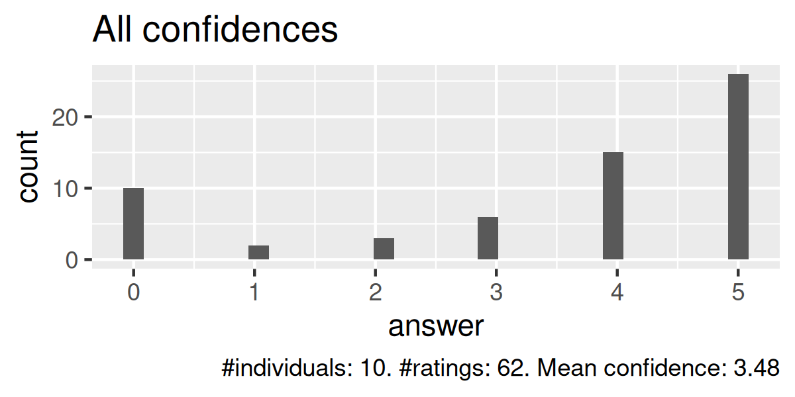
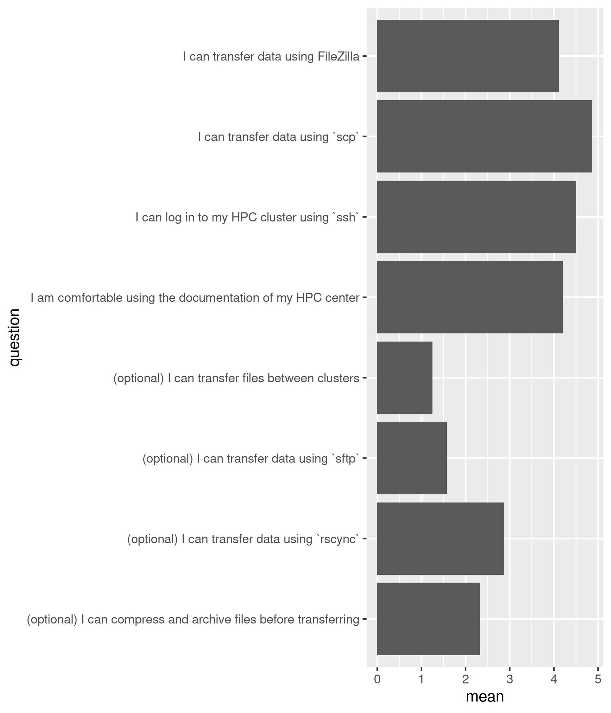
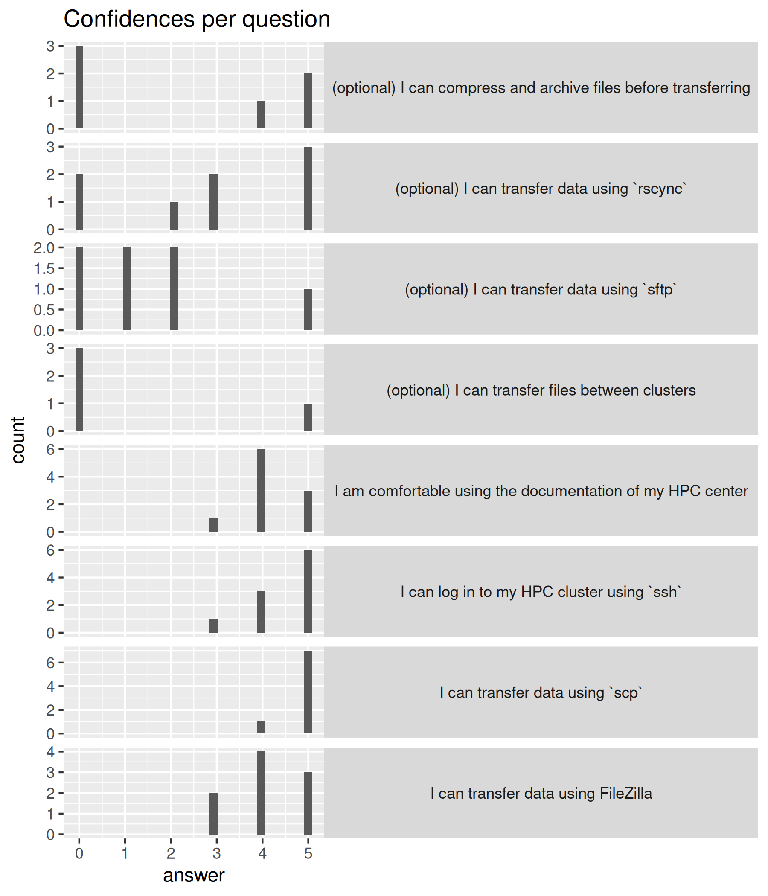

# Evaluation 2025-09-05

- Number of registrations: 29
- Number of learners present: 15 (52% show-up rate)
- Number of responses: 10 (67% fill-in rate)
- [Evaluation, by the learners](evaluation.csv)
- [Feedback from the learners](feedback.csv)
- [Chat](meeting_saved_new_chat.txt)

## Analysis

- [Analysis script](analyse.R)
- [Average confidences](average_confidences.csv)
- [Meeting chat](meeting_saved_new_chat.txt)
- [Success score](success_score.txt)
- [What Björn did well](bjorn_positive.txt)
- [What Björn can improve](bjorn_improve.txt)
- [What Richel did well](richel_positive.txt)
- [What Richel can improve](richel_improve.txt)
- [Any other feedback](other_feedback.txt)

## Say something positive about Björn

- Good and clear instructions
- Goes for both of you: the enthusiasm and being organized
- The instructions are clear, the process is smooth,
  and he is always ready to help.
  Really appreciate how approachable and well-organized.
- The explanations were clear and structured. It was easy to follow.
- Both teachers were positive and helpful
- Björn was very knowledgeable and patient.
- He was attentive and sticked to the course schedule

## Say something about Björn he can improve

- Nothing
- Maybe giving instructions step by step so that people
  with not so many experience can follow and remember what to do.

## Say something positive about Richèl

- Good and clear instructions
- Goes for both of you: the enthusiasm and being organized
- The instructions are clear, the process is smooth,
  and he is always ready to help.
  Really appreciate how approachable and well-organized.
- Thanks for making the course very interactive and
  sharing a lot of inputs and encouraging to try out new things.
- Both teachers were positive and helpful
- Very enthusiastic, knowledgeable and patient.
  He made me feel I want to know more.
- He gives feedback all the time
- He was extremely helpful throughout the course and managed meetings very
  effectively. He maintained a positive, energized attitude.
  When I encountered issues,
  he worked with me to find solutions and provided his support.

## Say something about Richèl he can improve:

- Nothing
- Would be nice to hear more in depth explanations in the breakout rooms,
  so more experienced people can also take advantage of Richèl's knowledge
  and experience.

## Any other feedback?

- Probably a live-stream-walk-through session will be good.
  This combine with pre-recorded video will help the students.
- NIce (naiss...) course with different levels,
  and enthusiastic teachers Björn and Richèl.
- The course website is good and looks clearly a lot of effort was put in.
  Looking forward to any other courses on HPC offered by your team
- Instead of just sending us to group rooms and documentation web pages,
  it would be good to first go through the most important commands
  for each task, for example the general rsync command for a file,
  a folder etc. and what to think of.
  Now it seemed as if it was different for different clusters,
  which it is not. Group rooms were still useful,
  but this would make the course go faster so that we could learn more.
- It was very useful to get an overview of the tools available!
  Björn and Richèl are very patient and experienced.
  It would be nice to have more time to discuss with the teachers
  about the pros and cons of tools and when to use them.
- Even though FileZilla is open source, I couldn't try it given the IT policies
- The course was helpful. Good team work in the zoom rooms was key,
  and I appreciated that the teachers were stopping by
  to ensure we were on track.
  I would suggest to facilitate the zoom link of the course also via mail,
  even if it is the same moment the course starts.
  The reason for this is that the first part of the course is
  about connecting to the server,
  a prerequisite that was already needed to obtain the zoom link.
  I missed the first 15 minutes of the course as I was struggling with that.
  Another suggestion is to include instructions for Windows users,
  for example in the FileZilla transfer and rsync parts. Thanks for the course!
- The course was valuable

