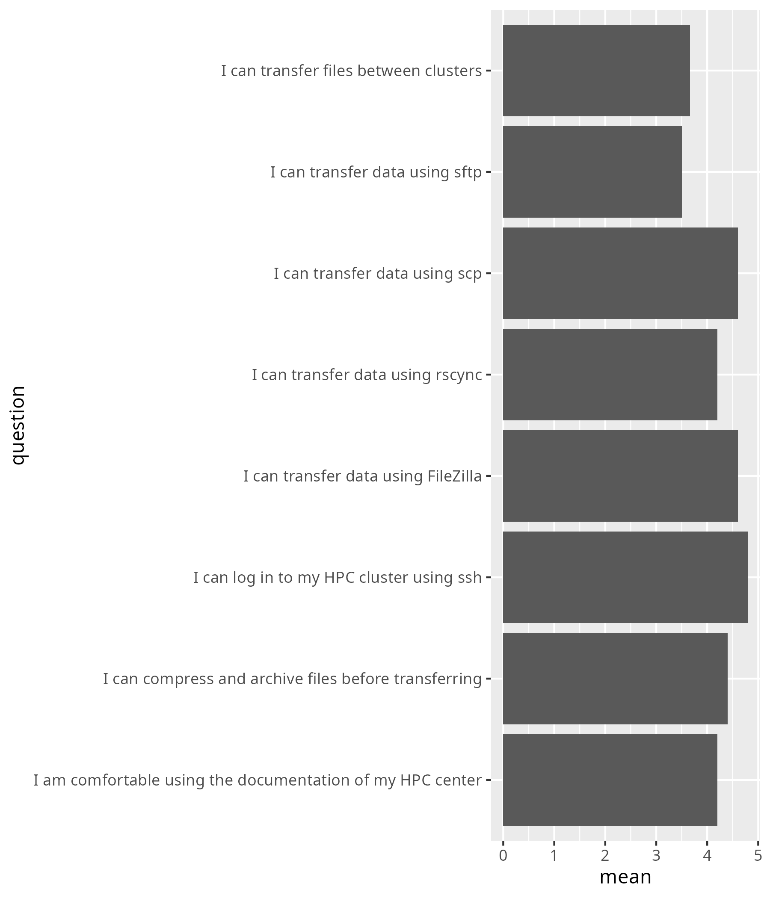

# Evaluation 2025-11-14

- Number of registrations: 22
- Number of learners present: 6 (27% show-up rate)
- Number of responses: 5 (83% fill-in rate)
- Success score: 86%
- [Evaluation, by the learners](evaluation.csv)
- Anonymous feedback from the learners: none

## Analysis

- [Analysis script](analyse.R)
- [Average confidences](average_confidences.csv)
- [Success score](success_score.txt)
- [What Björn did well](bjorn_positive.txt)
- [What Björn can improve](bjorn_improve.txt)
- [What Richel did well](richel_positive.txt)
- [What Richel can improve](richel_improve.txt)
- [Any other feedback](other_feedback.txt)

## Say something positive about Björn

- Very friendly and helpful
- Clear instructions
- Explained well the steps
- He tried to support as much as possible when we have problems

## Say something about Björn he can improve

- I have no comments; the course objectives were nicely met
- Maybe go more often to the Zoom rooms to check

## Say something positive about Richèl

- Also very friendly and helpful
- really encouraging energy for teaching!
- Very enthusiastic
- Explained well the content + questions
- Very positive energy

## Say something about Richèl he can improve

- I have no comments; the course objectives were nicely met
- Explain the alternatives to the resources used

## Any other feedback?

- Thanks a lot for this!
- I found the level a bit too easy for a 3hour course,
  but it fit what was in the learning objectives.
  Very nice structure with the prerequisite page
  and how to find the zoom url,
  that was a nice way to do an exercise which could be used
  for more aspects of the course.
- Perhaps you could provide a bit more detail before moving on to the groups,
  but I’m still happy with the course.
- Overview could be presented in the form of a slide just at start.
  But it is optional.
