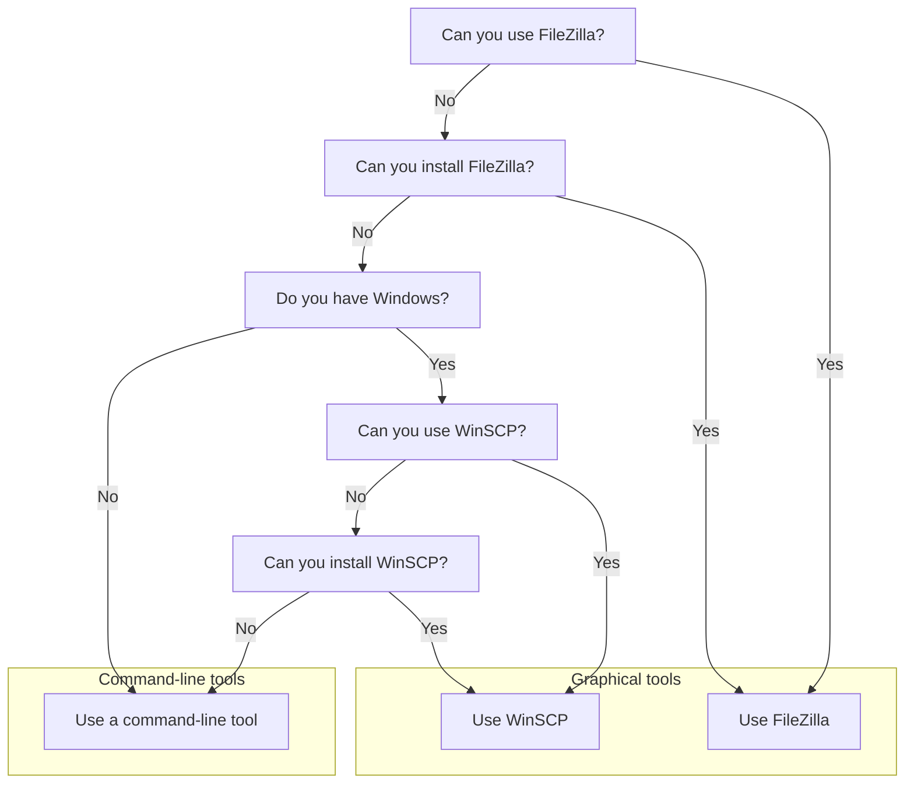
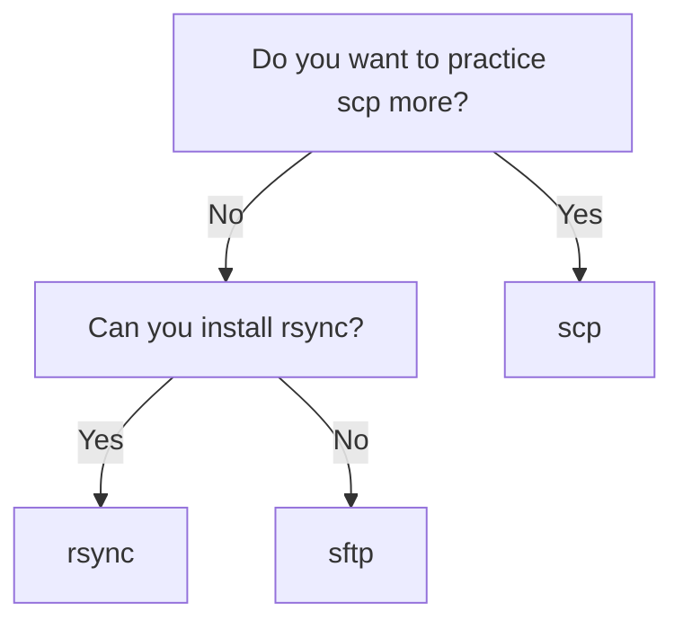

---
tags:
  - FAQ
  - frequently asked questions
  - questions
---

# Frequently Asked Questions

## When to follow the course

### When should I follow this course?

When you want to:

- connect to your favorite HPC cluster
- transfer files to/from your favorite HPC cluster

### When should I consider to **not** follow this course?

These are the reasons to consider to **not** follow this course:

#### Reason 1: you want to learn advanced things

When you have done your first file transfers and
expect to learn new and more advanced things.

In this case, the course will go too slow for you.

However, you will probably be put to work by the teachers
to help out other learners.
If you like to test your own knowledge by teaching others,
you will likely thrive in the course.

#### Reason 2: you have social anxiety

When you have social anxiety.

In this case, the course will be too social for you.

However, in this course, it is perfectly OK to give a wrong
answer or to say 'I do not know'. This is what a former
learner had to say on this:

You are welcome to try and leave anytime you want.
The course material is made for self-study too, with videos
for all exercises.
Do fill in [the evaluation](../evaluation.md)
when you leave early :-)

### How to cancel?

If you need to cancel, please unregister in the registration form
or [contact us](../contact_us.md). Thanks!

## Prerequisites

### Why are there so many prerequisites?

Because of constraints.

While planning the course,
we started out with two hour to
teach about login and filesystem navigation,
and four hours to do actual fle transfer.

When the constraint was added that the
course must be maximally three hours,
it meant that we would teach what the course
is about in the minority of the time.
As teachers, we accepted this at first,
and would only teach FileZilla and `rsync`.

However, then another constraint was added:
there should be more file transfer tools
discussed. And later: also connecting to an HPC must be added.

Instead of lecturing (we should not `[Hattie, 2023]`),
we decided to add prerequisites instead

### What are the prerequisites for following this course?

See [the course prerequisites](../prereqs/README.md).

### How can I check if I have registered?

You should have gotten a welcome email within a couple
of days.

When it doubt, register again or [contact us](../contact_us.md) :-)


### How to find the course's Zoom room?

The course's Zoom room will be emailed to you.

<!--

???- question "Want to see this in a video?"

    Watch the YouTube video
    [NAISS File Transfer course: How to find the course's Zoom room?](https://youtu.be/-ojBPH66mqw)

Here is how to find the course's Zoom room.
In total, these steps may take 2 days at minimum,
due to multiple waiting steps:

- Step 1: Register at [SUPR](https://supr.naiss.se/person/register/).

After doing so, it may take one evening before you are registered.
You will get an email when being registered.

- Step 2: After registration,
  on [SUPR](https://supr.naiss.se/), ask for membership of
  the course project `NAISS 2025/22-717`

After doing so, it may take some days being granted membership.
You will get an email when being granted access.

- Step 3: After having been granted membership
  [on SUPR, activate your user accounts](https://supr.naiss.se/account/)
  on Dardel and Tetralith. Tetralith is the HPC cluster that is recommended
  for this course.

After doing so, it may take some hours before your user account is activated.
You will get an email when being granted access.

- Step 4: [Log in to your HPC cluster](#how-can-i-login-to-an-hpc-cluster).
  Tetralith is the HPC cluster that is recommended
  for this course.
- Step 5: On your HPC cluster, find the URL of the Zoom room

HPC cluster|Path to folder
-----------|--------------
Dardel     |`/cfs/klemming/projects/supr/transfer_course/zoom_url.txt`
Tetralith  |`/proj/transfer_course/zoom_url.txt`

-->

### How can I check if I have a NAISS account?

When you can login at [https://supr.naiss.se/](https://supr.naiss.se/).

???- question "How does that look like?"

    It should look similar to this:

    

### How can I check if I can login to an HPC cluster using SSH?

By doing so :-)

The material to do so can be found at
[the session 'Login to a console environment'](../sessions/login_console/README.md).

### How can I login to an HPC cluster?

By doing so :-)

There are multiple ways to login to an HPC cluster.
The material to help you choose can be found at
[the session 'Connect'](../sessions/intro_connect/README.md).

### Is it OK if I can login to an HPC cluster using other methods?

Probably: yes

- Using a web browser: yes
- Using a remote desktop client: yes
- Using a local ThinLinc client: yes
- Using Remmina: yes
- Using `krdp`: yes
 
## How to install MobaXterm?

This is for **Windows** users only.

Install MobaXterm from [the MobaXterm website](https://mobaxterm.mobatek.net/).

### How to check that I've installed MobaXterm?

Run it. If it shows up, you've installed MobaXterm.

??? attention "I cannot install MobaXterm on my Windows computer"

    - Use the **Command prompt**.
      Use it by typing `cmd` in the _Windows Search window_.

## How to install rsync?

This is for Linux and Mac users only.

For Linux, in a terminal, run:

```bash
sudo apt install rsync
```

For Mac, in a terminal, run:

```bash
brew rsync
```

### Windows

- Try `rsync` from MobaXterm.
- If you haven't got MobaXterm, type `cmd` in the _Windows Search window_
  and start **Windows Command Prompt**.
    - Try `rsync` from here.

??? attention "Still doesn't work?"

    [According to this post](https://superuser.com/a/1869930), for Windows 11,
    in a terminal, run:

    ```bash
    pacman -S rsync
    ```

## How to check that I've installed `rsync`?

In a terminal, type:

```bash
rsync --version
```

If you see the `rsync` version displayed, you've installed `rsync`.

???- question "How does that look like?"

    Your output will look similar to this:

    ```bash
    richel@richel-N141CU:~$ rsync --version
    rsync  version 3.2.7  protocol version 31
    Copyright (C) 1996-2022 by Andrew Tridgell, Wayne Davison, and others.
    Web site: https://rsync.samba.org/
    Capabilities:
        64-bit files, 64-bit inums, 64-bit timestamps, 64-bit long ints,
        socketpairs, symlinks, symtimes, hardlinks, hardlink-specials,
        hardlink-symlinks, IPv6, atimes, batchfiles, inplace, append, ACLs,
        xattrs, optional secluded-args, iconv, prealloc, stop-at, no crtimes
    Optimizations:
        SIMD-roll, no asm-roll, openssl-crypto, no asm-MD5
    Checksum list:
        xxh128 xxh3 xxh64 (xxhash) md5 md4 sha1 none
    Compress list:
        zstd lz4 zlibx zlib none
    Daemon auth list:
        sha512 sha256 sha1 md5 md4

    rsync comes with ABSOLUTELY NO WARRANTY.  This is free software, and you
    are welcome to redistribute it under certain conditions.  See the GNU
    General Public Licence for details.
    ```

## How to install FileZilla?

Under Ubuntu, you can can use the Ubuntu App Center.

???- question "How does the Ubuntu App Center look like?"

    Here:

    

For non-Ubuntu users, search the web, download and install.

???- question "Where can I find it?"

    The FileZilla website can be found at
    [`https://filezilla-project.org/`](https://filezilla-project.org/).

    Clicking on 'Download FileZilla client' takes you to
    [the FileZilla download page](https://filezilla-project.org/download.php?type=client).

    Download the file, maybe unzip it and run the installer

## How to check that I've installed FileZilla?

Run it. If it shows up, you've installed FileZilla.

## What if I cannot install FileZilla?

Here is a decision tree which program to install:



So, if you can install WinSCP,
see [how to install WinSCP](#how-to-install-winscp).
Else, you will have to pick your favorite command-line tool,
following the decision tree here:



So:

- if you want to practice
  `scp` more, [go the session about `scp`](../sessions/scp/README.md)
- if you can install `rsync` (i.e. you can install software and you do not
  have the Windows operating system),
  see [how to install `rsync`](#how-to-install-rsync),
  then [go the session about `rsync`](../sessions/rsync/README.md)
- else, [go the session about `sftp`](../sessions/sftp/README.md)

## Which HPC clusters have FileZilla installed?

HPC Cluster|Has FileZilla installed?
-----------|------------------------
Alvis      |Yes
Berzelius  |Unknown, as this is not a NAISS cluster
Bianca     |No
COSMOS     |No
Dardel     |No
Kebnekaise |Unknown, as this is not a NAISS cluster
LUMI       |No
Pelle      |No
Tetralith  |No
Vera       |Unknown, as this is not a NAISS cluster

## How to install WinSCP?

- [WinSCP](https://winscp.net/eng/index.php) is a secure file transfer tool
  that works under Windows.


## How to check that I've installed WinSCP?

Run it. If it shows up, you've installed WinSCP.

## Which HPC clusters have WinSCP installed?

None! All covered clusters are Linux machines!

## How can I check if I have a good Zoom setup?

- You are in a room where you can talk
- You talk into a (standalone or headset) microphone
- Others can clearly hear you when you talk
- Others can see you
- You can hear others clearly when they talk

### How can I get a good Zoom setup?

- Find/schedule/book a room where you can talk
- Buy a simple headset

### What if I don't have a good Zoom setup? Is that OK?

No.

You will feel left out, as the course in highly interactive.
It would be weird to the other learners.

## Teaching

### Why is the course learner-centered?

Because that is good teaching.

This course defines good teaching as 'evidence-based methods to let learners
acquire new skills and the monitoring of this acquisition'.
This means that it should be observed that learners need more/less to time
to practice and following the schedule based on that. Learner-centered teaching
has an effect size from 0.36 `[Hattie ranking]`
or 0.64/0.70 `[Cornelius-White, 2007][Hattie, 2012]`.

## Website

### Why is the repository owner `UPPMAX` instead of NAISS?

Because NAISS does not have a GitHub owner page yet.

## References

- `[Cornelius-White, 2007]` Cornelius-White, Jeffrey.
  "Learner-centered teacher-student relationships are effective:
  A meta-analysis." Review of educational research 77.1 (2007): 113-143.
- `[Hattie, 2023]` Hattie, John. Visible learning:
  The sequel: A synthesis of over 2,100 meta-analyses relating to achievement.
  Routledge, 2023. The effect size of lecturing can be found on page 363,
  which has an effect size of -0.26 with a robustness index of 4 out of 5
  and is based on 3 meta analyses using 273 studies using 27,296 people,
  measuring for 614 effects with a standard error of 0.08.
  One example open access study is `[Knight & Wood, 2005].`
- `[Hattie ranking]` [The Hattie Ranking](https://visible-learning.org/hattie-ranking-influences-effect-sizes-learning-achievement/)
- `[Knight & Wood, 2005]` Knight, Jennifer K., and William B. Wood.
  "Teaching more by lecturing less." Cell biology education 4.4 (2005): 298-310.
  [paper](https://www.lifescied.org/doi/full/10.1187/05-06-0082)
