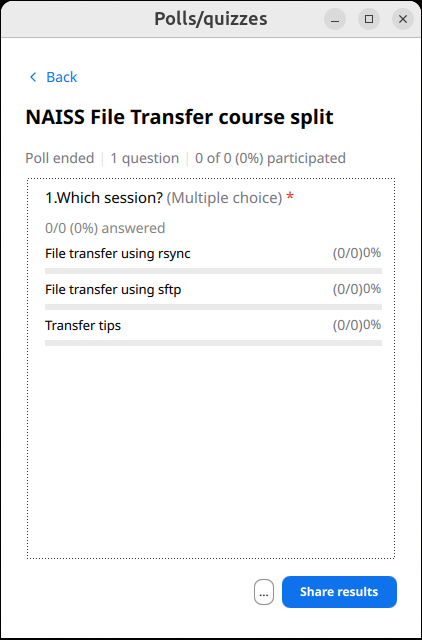

# Lesson plan 2025-09-05

- Author: Richel

## 2025-09-03

I've updated all course material to include LUMI and Pelle.
All issues are done.

I've asked if BC could use my help, he gave me something to do, and I did it.

Let's take a look at the schedule and get a status:

Time  |Teacher|Topic                                                 |Status
------|-------|------------------------------------------------------|------
9:00  |B      |Intro                                                 |Not mine
9:05  |B      |Login with terminal                                   |Not mine
.     |B      |File transfer using `scp`                             |Not mine
9:50  |.      |Break                                                 |Not mine
10:05 |B      |File transfer using `scp` cont'd                      |Not mine
.     |R      |File transfer using FileZilla                         |9/10
11:00 |.      |Break                                                 |Done
11:15 |R      |Help decide what to pick, split up according to choice|9/10
.     |R      |(optional) File transfer using `rsync`                |9/10
.     |B      |(optional) Transfer tips                              |Not mine
.     |B      |(optional) File transfer using `sftp`                 |Not mine
11:45 |B      |Summary                                               |9/10
11:50 |R      |Evaluation                                            |9/10
12:00 |.      |Done!                                                 |Done :-)

BC reported that there are 29 registrations. Based
on the 27% show-up rate of the previous' course iteration,
one expects 8 learners. However, that last course iteration,
there was 1 in 4 that did not do the prerequisites.
In this course, these persons do not show up, as they
cannot find the Zoom link.
Hence, I predict 8 minus 25% = 6 learners to be present.

For the 'voting' session at 11:15, I've prepared a Zoom poll:

Done!

## 2025-09-05

At 8:00, I was ready. Let's go!
