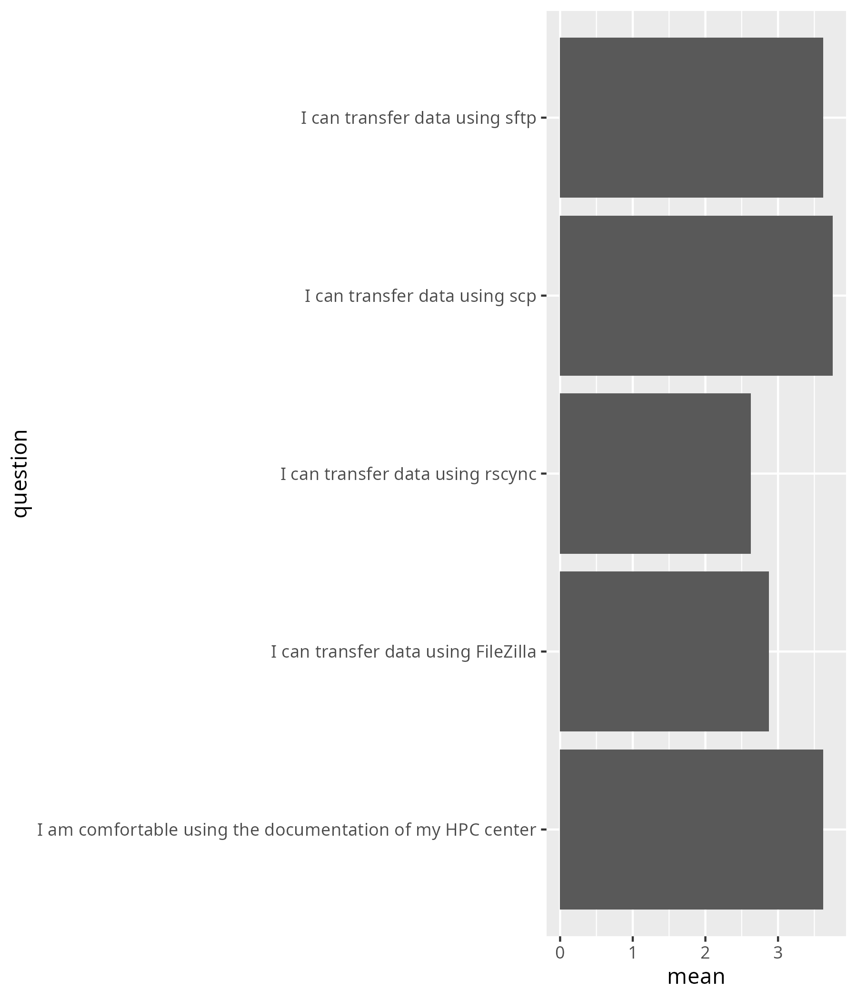

---
tags:
  - reflection
  - 2025-03-07
  - 20250307
---

# Reflection 2025-03-07

This was the first iteration of this course, which made it hard
to make any predictions.

Based on the first NAISS-wide 'Intro to
Python' course (of 2025-03-04), all we could expect is that
25% of all registrationed participants would show up.
This turned out to be true, with 24% (37 registrations, 9 learners
that stayed the whole course).

How well the schedule would work was a big unknown. I talked to
my collegue that I want him to teach, but with a student-centered approach,
this may not have worked. We were both open and flexible about this.
The schedule, however, turned out reasonably well, with my colleague
indeed being able to lead his sessions in the alloted times.

The breaks were a source of confusion: the first was at 9:50, the second
at 11:00. It turned out that the first session could use 10 more minutes.

- [ ] Suggest for next time: breaks at 10:00 and 11:00

These are some notes about the course in time:

Time |Description
-----|---------------------------------------
9:00 |Start
9:17 |Learners to BO rooms
9:30 |One learner left due to bad internet
9:37 |First group done with FileZilla
9:43 |Second group done with FileZilla
10:30|One learner left due to unknown reasons
10:43|One learner left due to unknown reasons
11:18|BC starts lecture
11:34|BC ends lecture, starts questions
11:37|Learners go to BO rooms
11:52|Evaluation starts
12:02|Last learner leaves

The evaluation questions should be changed: 
'I am confortable to transfer files to/from my cluster' should be
added, as this is the main goal of the course.

- [ ] Add: 'I am confortable to transfer files to/from my cluster'

Additionally, BC's later addition about zipping files should have
been added too.

- [ ] Add: 'I am confortable to transfer files to/from my cluster'

The two learners that used Alvis had a heard time: both
FileZilla and `rsync` (under Windows) are hardest to use there.
They were deligted when `scp` worked directly.
Maybe we should start with `scp`, as it is already pre-installed
on all computers?

These are the amount of learners per cluster,
including learners that were there for short amount of time
and/or used two clusters:

HPC cluster name|Number of learners
----------------|------------------
Alvis           |3
Bianca          |1
COSMOS          |1
Dardel          |0
Kebnekaise      |1
Rackham         |2
Tetralith       |3

I think the comparison of the different tools should have been done
stronger:

- [ ] Add 'Can do remote to remote yes/no'
- [ ] Add 'Can do large files yes/no'

HIERO

## Reflection on evaluation results

- Number of registrations: 37
- Number of active learners: 9 (24% show-up rate)
- Number of evaluations: 8 (89% response rate)
- Average confidence: 3.3 (out of 5)
- Success score (i.e. average confidence rescaled to 100%): 66%

### Say something positive about Richèl

- Clear communication, really wanted to help
- Very enthusiastic and motivating teacher
- He was very friendly and made the course very enjoyable to attend
- He was really interested in me being able to use rsync and made sure that I could connect to the cluster to be able to do the exercises despite not having access to the course cluster.
- He encourages learners to find ways to find the answer
- Very motivating, he keeps us awake without the coffee

### Say something about Richèl he can improve

- Doesn't always listen very well.
- Sometimes it is hard to guess what is the next thing to do.

### Any other feedback?

- It would be nice to start with scp and sftp so it's more likely you'll succeed with at least something, then getting stuck on filezilla and rsync for two hours and almost wanting to give up. 
- I think as one of the prerequisites, all users should use same terminal type (like Ubuntu) and participants installed Ubuntu if they use windows prior to the course.
- I couldn't use rsync but I could use sftp and scp. filefilla I didn't have time to try it but I will. Thank you very much!
- Add rsync to the requirements and steps on how to install it
- Thanks!

