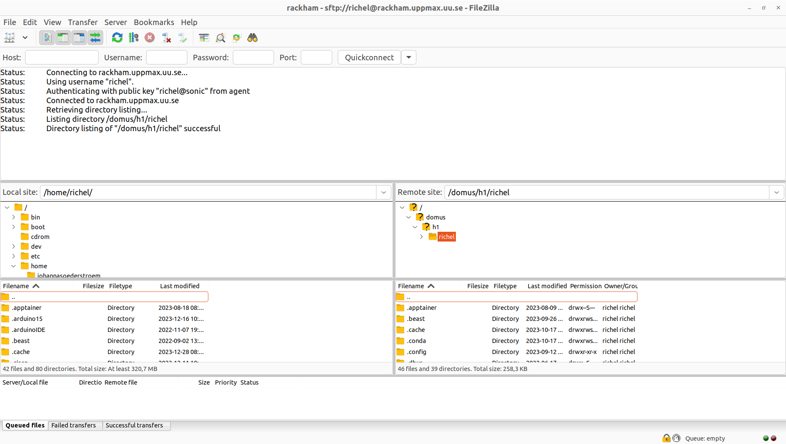

---
tags:
  - lesson
  - session
  - file transfer
  - FileZilla
---

# File transfer using FileZilla

!!!- info "Learning outcomes"

    - Practice using the documentation of your favorite HPC cluster
    - Can install FileZilla
    - Can transfer files using FileZilla

???- question "For teachers"

    Teaching goals are:

    - Learners have practiced using the documentation
      of their favorite HPC cluster
    - Learners have installed FileZilla
    - Learners have transferred files using FileZilla

    Prior questions:

    - Who has heard of FileZilla?
    - Who has already used FileZilla?
    - What are features of FileZilla?

    Feedback questions:

    - Q: What are features of FileZilla?
        - A: visual
        - A: intuitive to use
        - A: can save passwords
        - A: can use `.ppk` files
    - Q: What are weaknesses of FileZilla?
        - A: cannot transfer between two remote locations
        - A: an interrupted file transfer means a new transfer from the start

!!! info "FileZilla in action"

    

    > FileZilla being able to do file transfer to/from
    > UPPMAX's Rackham HPC cluster.

## Why use FileZilla

Fairly sure you'll want to upload or download files to your HPC cluster.
Here we do so.

We use a free and open-source graphical tool to do this,
called FileZilla.
It works under Linux, Mac and Windows.

???- question "What are similar graphical tools?"

    Tool                                      |Platforms
    ------------------------------------------|-------------------
    [CyberDuck](https://cyberduck.io/)        |Linux, Mac, Windows
    [WinSCP](https://winscp.net/eng/index.php)|Windows

## Exercises

???- question "Need a video?"

    Here are videos that do this exercises for the different HPC clusters:

    HPC Cluster|YouTube video
    -----------|------
    Alvis      |[YouTube video](https://youtu.be/A8zfd0o0uzI)
    Berzelius  |Cannot: is not a NAISS cluster
    Bianca     |[YouTube video](https://youtu.be/DYPWawyK5UE)
    COSMOS     |[YouTube video](https://youtu.be/T4qqN_ljsS8)
    Dardel     |[YouTube video](https://youtu.be/_3EmkN619Xo)
    Kebnekaise |[YouTube video](https://youtu.be/ot8TQRVaNPY)
    LUMI       |[YouTube video](https://youtu.be/PjzMuMIyj40)
    Pelle      |[YouTube video](https://youtu.be/NOHYNj1vW28)
    Tetralith  |[YouTube video](https://youtu.be/qzV3oY5fZbE)
    Vera       |Cannot: is not a NAISS cluster

???- question "How difficult will this be?"

    This depends mostly on your HPC cluster:

    <!-- markdownlint-disable MD013 --><!-- Tables cannot be split up over lines, hence will break 80 characters per line -->

    HPC Cluster|Difficulty|Reason
    -----------|----------|-------------------------------------------
    Alvis      |Hard      |Need `.ppk` files
    Berzelius  |Easy      |Simple procedure, specialized documentation
    Bianca     |Easy      |Simple procedure, specialized documentation
    COSMOS     |Medium    |No specialized documentation yet
    Dardel     |Hard      |Need `.ppk` files
    Kebnekaise |Easy      |Simple procedure, specialized documentation
    LUMI       |Hard      |Need `.ppk` files, [CSC refuses to document this](https://github.com/UPPMAX/naiss_file_transfer_course/issues/34#issuecomment-2882884189), however there is [specialized documentation at UPPMAX](https://docs.uppmax.uu.se/naiss/lumi_file_transfer_using_filezilla/)
    Pelle      |Easy      |Simple procedure, specialized documentation
    Tetralith  |Easy      |Simple procedure, specialized documentation
    Vera       |Medium    |No specialized documentation yet

    <!-- markdownlint-enable MD013 -->

???- question "Where is the documentation of my favorite HPC cluster?"

    <!-- markdownlint-disable MD013 --><!-- Tables cannot be split up over lines, hence will break 80 characters per line -->

    HPC Cluster|Documentation
    -----------|------------
    Alvis      |[Documentation](https://www.c3se.chalmers.se)
    Berzelius  |[Documentation](https://www.nsc.liu.se)
    Bianca     |[Documentation](https://docs.uppmax.uu.se)
    COSMOS     |[Documentation](https://lunarc-documentation.readthedocs.io)
    Dardel     |[Documentation](https://menzzana.github.io/NAISS-support-web)
    Kebnekaise |[Documentation](https://docs.hpc2n.umu.se/)
    LUMI       |[Documentation](https://docs.csc.fi)
    Pelle      |[Documentation](https://docs.uppmax.uu.se)
    Rackham    |[Documentation](https://docs.uppmax.uu.se)
    Tetralith  |[Documentation](https://www.nsc.liu.se)
    Vera       |[Documentation](https://www.c3se.chalmers.se)

    <!-- markdownlint-enable MD013 -->

## Exercise 1: transfer a file

Use the documentation of your HPC cluster for help.

- **For maximally 5 minutes**, search for the procedure on how to transfer a file
  to/from your HPC cluster using FileZilla. Take a look at the answer if you
  cannot find it: sometimes there *is* no documentation

???- question "Where is that documentation?"

    <!-- markdownlint-disable MD013 --><!-- Tables cannot be split up over lines, hence will break 80 characters per line -->

    HPC Cluster|Documentation
    -----------|------------
    Alvis      |None. [Documentation that is closest](https://www.c3se.chalmers.se/documentation/file_transfer/bulk_data_transfer/). Use [the UPPMAX documentation](https://docs.uppmax.uu.se/naiss/alvis_file_transfer_using_filezilla/) instead
    Berzelius  |[Documentation](https://www.nsc.liu.se/support/2fa/clients/windows/filezilla/)
    Bianca     |[Documentation](https://docs.uppmax.uu.se/software/bianca_file_transfer_using_filezilla/)
    COSMOS     |None. [Documentation that is closest](https://lunarc-documentation.readthedocs.io/en/latest/guides/data_transfer/io_winscp/). Use [this documentation](https://docs.uppmax.uu.se/naiss/cosmos_file_transfer_using_filezilla/) instead
    Dardel     |None. [Documentation that is closest](https://menzzana.github.io/NAISS-support-web/contact/contact_support/), under 'Data management -> File transfer'. Use [this documentation](https://docs.uppmax.uu.se/naiss/dardel_file_transfer_using_filezilla/) instead
    Kebnekaise |[Documentation (Linux and Mac)](https://www.hpc2n.umu.se/documentation/guides/linux-connection) and [documentation (Windows)](https://www.hpc2n.umu.se/documentation/guides/windows-connection)
    LUMI       |None. [CSC refuses to document this](https://github.com/UPPMAX/naiss_file_transfer_course/issues/34#issuecomment-2882884189). Use [the UPPMAX documentation](https://docs.uppmax.uu.se/naiss/lumi_file_transfer_using_filezilla/) instead
    Pelle      |[Documentation](https://docs.uppmax.uu.se/software/pelle_file_transfer_using_filezilla)
    Tetralith  |[Documentation](https://www.nsc.liu.se/support/2fa/clients/windows/filezilla/)
    Vera       |None. [Documentation that is closest](https://www.c3se.chalmers.se/documentation/file_transfer/filesystem/#copying-files-into-and-out-of-the-system)

    <!-- markdownlint-enable MD013 -->

- Follow that procedure to transfer a file
- Use the file explorer to verify that files indeed are transferred

## (optional) Exercise 2: transfer a compressed file

One of the biggest bottlenecks for file transfer speed is file size.

In this optional exercise, we'll compress the file before transferring,
and decompress it at its destination.

- Download an example file from [`examplefile.com`](https://www.examplefile.com/),
  that has the size you are interested in,
  for example
  [this 100 MB text file](https://www.examplefile.com/file-download/25)
- Compress the file in your file explorer

??? question "How do I do so?"

    This differs per operating system, but this approach will
    work in a lot of settings:

    In your file explorer, click the right mouse button.
    A pop-up will appear, where you click on 'Compress file'
    or  'Zip file'

    

    If a dialog appears with the question how to name the compressed
    file with/without the compression method, give it a proper name
    and select the 'Zip' format.

    

- View the file size in your file explorer.
  When uploading the compressed file, how much faster do you predict
  this to be?

???- question "Answer"

    In this case, the file size went from 100 MB to 0.3 MB:

    

    From this, one can predict that the upload will be (`100 / 0.3 =`)
    around 300 times faster

- Upload the compressed file and decompress it at the remote
  location.

???- question "Answer"

    How to decompress depends on the environment where it is uploaded
    to.

    In some cases, with a graphical user environment, one has access
    to right-click on the compressed file and select 'Decompress' (or something
    similar)

    In some cases, with a console environment, one has to use a command
    called `unzip` to unzip the file, e.g `unzip my_file.zip`

