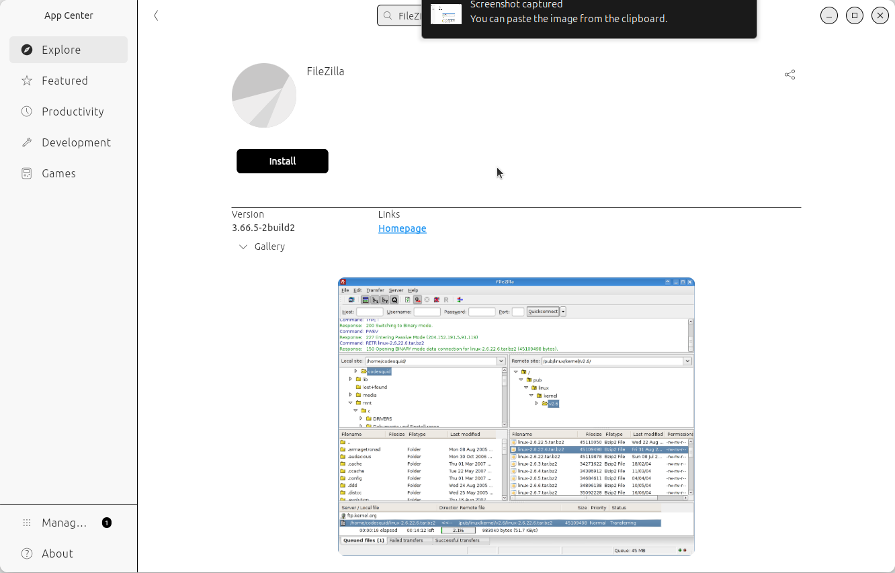

---
tags:
  - lesson
  - file transfer
  - FileZilla
---

# File transfer using FileZilla

!!!- info "Learning objectives"

    - Practice using the documentation of their HPC center
    - Can install FileZilla
    - Can transfer files using FileZilla

???- question "For teachers"

    Teaching goals are:

    - Learners have practiced using the documentation of their HPC center
    - Learners have installed FileZilla
    - Learners have transferred files using FileZilla

    Lesson plan:

    ```mermaid
    gantt
      title File transfer using FileZilla
      dateFormat X
      axisFormat %s
      section First hour
      Prior : prior, 0, 5s
      Present: present, after prior, 2s
      %% It took me 7 mins, here I do that time x2
      Challenge: crit, challenge, after present, 14s
      Feedback: feedback, after challenge, 7s
    ```

    Prior questions:

    - What is a file tranfer?
    - How can one do a file transfer?
    - Can you name some programs that can do file transfer?
    - Who has heard of FileZilla?
    - Who has already used FileZilla?
    - What are features of FileZilla?


> FileZilla being able to do file transfer to/from
> UPPMAX's Rackham HPC cluster.

## Why?

Fairly sure you'll want to upload or download files to your HPC cluster.
Here we do so.

We use a free and open-source graphical tool to do this,
called FileZilla.
It works under Linux, Mac and Windows.

## Exercises

???- question "Need a video?"

    Here are videos that do this exercises for the differt HPC clusters:

    - [UPPMAX's Rackham](https://youtu.be/CyJbWHZbvJU)

### Exercise 1: install FileZilla

Install FileZilla.

Under Ubuntu, you can can use the Ubuntu App Center.

???- question "How does the Ubuntu App Center look like?"

    Here:

    

For non-Ubuntu users, search the web, download and install.

???- question "Where can I find it?"

    The FileZilla website can be found at <https://filezilla-project.org/>.

    Clicking on 'Download FileZilla client' takes you to the
    FileZilla download page at <https://filezilla-project.org/download.php?type=client>.

    Download the file, maybe unzip it and run the installer

### Exercise 2: transfer a file

Use the documentation of your HPC cluster for help.

- Search for the procedure on how to transfer a file
  to/from your HPC cluster using FileZilla

???- question "Where is that documentation?"

    - [UPPMAX's Rackham](https://docs.uppmax.uu.se/software/rackham_file_transfer_using_filezilla)

- Follow that procedure to transfer a file
- Use the file explorer to verify that files indeed are transferred
