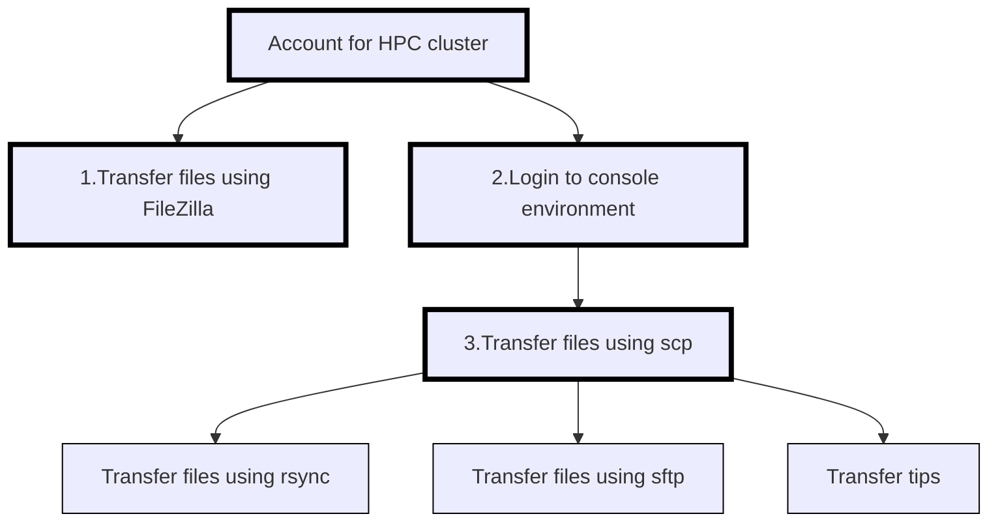

---
tags:
  - session
  - lesson
  - intro
  - introduction
  - overview
---

# Introduction

!!!- info "Learning outcomes"

    - Can find an overview of the course
    - Have seen the file transfer tools at this course
    - Have seen where to put anonymous feedback
    - Have included HPC cluster name in Zoom username,
      e.g. `[Dardel] Sven Svensson`

???- question "For teachers"

    Teaching goals are:

    - Learners can find an overview of the course
    - Learners have seen the file transfer tools at this course
    - Learners have seen where to put anonymous feedback
    - Learners have included thir HPC cluster name in Zoom username

    Prior questions:

    - What is a file tranfer?
    - What does one need to do a file transfer?
    - How does it look like to do a file transfer?
    - Can you name some programs that can do file transfer?

## Overview

Below an overview of the sessions and their relations.
The optional sessions have thinner borders.

As per [prerequisites](../prereqs/README.md):

- you already have an account at an HPC cluster
- you can already log in to a console environment at your HPC cluster
  using SSH

Here is an overview of the file transfer tools in this course:

<!-- markdownlint-disable MD013 --><!-- Tables cannot be split up over lines, hence will break 80 characters per line -->

Feature                                | FileZilla                | `scp`                        | `rsync`                       | `sftp`
---------------------------------------|--------------------------|------------------------------|-------------------------------|------------------------------
Summary                                | Intuitive                | Preinstalled                 | Powerful                      | Like a portal
Type of user interface                 | Graphical                | Terminal                     | Terminal                      | Terminal
Can transfer files between clusters?   | No                       | Yes                          | Yes                           | Yes
Installation needed?                   | Yes                      | Maybe                        | Yes                           | Maybe
Suitable for large files?              | Not really               | Not really                   | Yes                           | Not really
Behavior upon overwriting files        | Asks                     | Overwrite                    | Overwrite if newer            | Asks
Suitable for sensitive data?           | Yes                      | Yes                          | Yes                           | Yes
Tolerant to interruption?              | No                       | No                           | Yes                           | No
Flexibility                            | Some                     | Some                         | High                          | Low

<!-- markdownlint-enable MD013 -->

