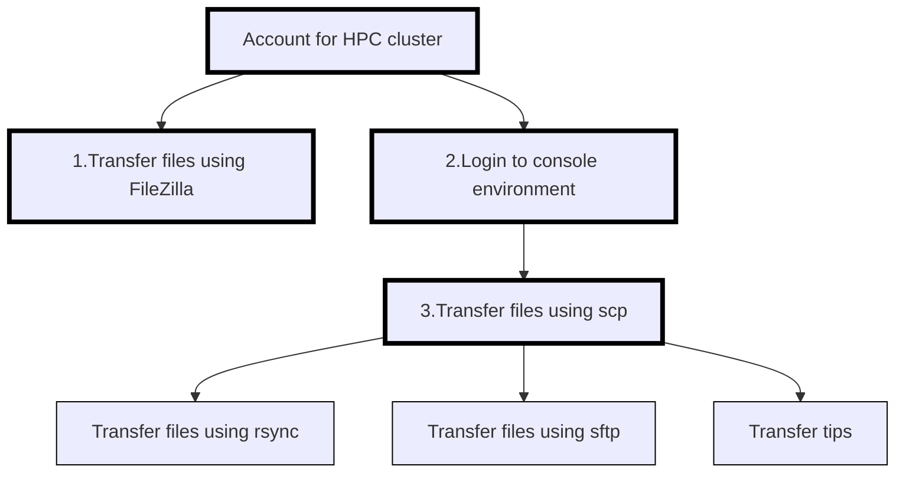

---
tags:
  - session
  - lesson
  - intro
  - introduction
  - overview
---

# Introduction

!!!- info "Learning outcomes"

    - Can find an overview of the course
    - Can find the [schedule](../schedule.md)
    - Have seen the file transfer tools at this course
    - Have seen where to put
      [anonymous feedback during the day](evaluation.md#any-feedback-during-the-day)
    - Have included HPC cluster name in Zoom username,
      e.g. `[Dardel] Sven Svensson`

???- question "For teachers"

    Teaching goals are:

    - Learners can find an overview of the course
    - Learners can find the [schedule](../schedule.md)
    - Learners have seen the file transfer tools at this course
    - Learners have seen where to put
      [anonymous feedback during the day](evaluation.md#any-feedback-during-the-day)
    - Learners have included thir HPC cluster name in Zoom username

    Prior questions:

    - What is a file tranfer?
    - What does one need to do, to be able to do a file transfer?
    - How does it look like to do a file transfer?
    - Can you name some programs that can do file transfer?

## Overview

Below an overview of the sessions and their relations.
The optional sessions have thinner borders.

As per [prerequisites](../prereqs/README.md):

- you already have an account at an HPC cluster
- you can already log in to a console environment at your HPC cluster
  using SSH

Here is an overview of the file transfer tools in this course:

<!-- markdownlint-disable MD013 --><!-- Tables cannot be split up over lines, hence will break 80 characters per line -->

Feature                                | FileZilla                | `scp`                        | `rsync`                       | `sftp`
---------------------------------------|--------------------------|------------------------------|-------------------------------|------------------------------
Summary                                | Intuitive                | Preinstalled                 | Powerful                      | Like a portal
Type of user interface                 | Graphical                | Terminal                     | Terminal                      | Terminal
Can transfer files between clusters?   | No                       | Yes                          | Yes                           | Yes
Installation needed?                   | Yes                      | Maybe                        | Yes                           | Maybe
Suitable for large files?              | Not really               | Not really                   | Yes                           | Not really
Behavior upon overwriting files        | Asks                     | Overwrite                    | Overwrite if newer            | Asks
Suitable for sensitive data?           | Yes                      | Yes                          | Yes                           | Yes
Tolerant to interruption?              | No                       | No                           | Yes                           | No
Flexibility                            | Some                     | Some                         | High                          | Low

<!-- markdownlint-enable MD013 -->

Here is an overview of the documentation pages for each HPC center:

<!-- markdownlint-disable MD013 --><!-- Tables cannot be split up over lines, hence will break 80 characters per line -->

HPC Cluster|Link to documentation
-----------|------------
Alvis      |[here](https://www.c3se.chalmers.se)
Berzelius  |[here](https://www.nsc.liu.se)
Bianca     |[here](https://docs.uppmax.uu.se)
COSMOS     |[here](https://lunarc-documentation.readthedocs.io)
Dardel     |[here](https://support.pdc.kth.se/doc/)
Kebnekaise |[here](https://docs.hpc2n.umu.se/)
LUMI       |[here](https://docs.csc.fi)
Rackham    |[here](https://docs.uppmax.uu.se)
Tetralith  |[here](https://www.nsc.liu.se)
Vera       |[here](https://www.c3se.chalmers.se)

<!-- markdownlint-enable MD013 -->

## Exercises

### Exercise 0: rename yourself

Please change your Zoom name to start with your HPC cluster,
e.g. `[Rackham] Sven`.

### Exercise 1: remember a Zoom room

We will use breakout rooms, as this is best for learning.
Ideally, each breakout room has 2 learners for the same HPC cluster.

HPC cluster name|Main breakout room
----------------|------------------
Alvis 1         |Room 1
Alvis 2         |Room 2
Bianca          |Room 3
COSMOS 1        |Room 4
COSMOS 2        |Room 5
Dardel 1        |Room 6
Dardel 2        |Room 7
Dardel 3        |Room 8
Dardel 4        |Room 9
Dardel 5        |Room 10
Tetralith 1     |Room 11
Tetralith 2     |Room 12
Other 1         |Room 13
Other 2         |Room 14

- When your first breakout room reaches 4 learners, decide upon 2 to
  move to the next breakout room.
  Repeat until the group size is below 4.
- When you are the only one in your main breakout room,
  the teachers will let you decide to either work in silence or
  to join another group. You will be taken care of well :-)
