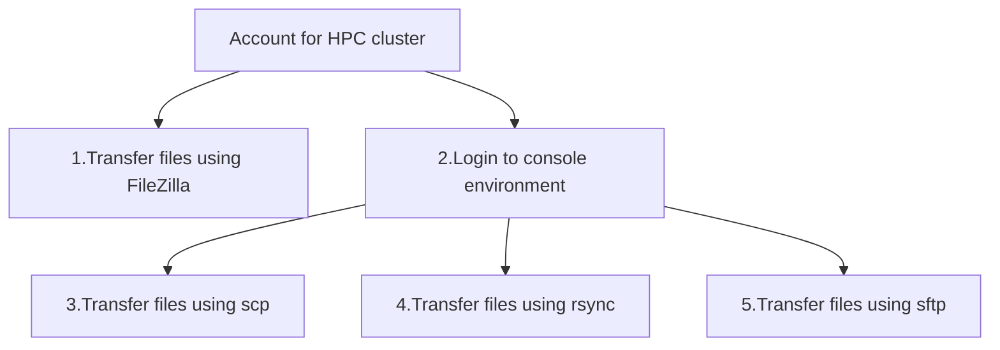

---
tags:
  - session
  - lesson
  - intro
  - introduction
  - overview
---

# Introduction

!!!- info "Learning outcomes"

    - Can find an overview of the course
    - Have seen the file transfer tools at this course
    - Have seen where to put anonymous feedback
    - Have included HPC cluster name in Zoom username,
      e.g. `[Dardel] Sven Svensson`

???- question "For teachers"

    Teaching goals are:

    - Learners can find an overview of the course
    - Learners have seen the file transfer tools at this course
    - Learners have seen where to put anonymous feedback
    - Learners have included thir HPC cluster name in Zoom username

    Prior questions:

    - What is a file tranfer?
    - What does one need to do a file transfer?
    - How does it look like to do a file transfer?
    - Can you name some programs that can do file transfer?

## Overview

Here is an overview of the sessions and their relations:

As per [prerequisites](../prereqs/README.md):

- you already have an account at an HPC cluster
- you can already log in to a console environment at your HPC cluster
  using SSH

Here is an overview of the file transfer tools in this course:

<!-- markdownlint-disable MD013 --><!-- Tables cannot be split up over lines, hence will break 80 characters per line -->

Tool       |User interface|Can transfer between clusters?|Installation needed?                  |Large files? |Overwrite? |Suitable for sensitive data?|Tolerant to interruption?|Other
-----------|--------------|------------------------------|--------------------------------------|-------------|-----------|----------------------------|-------------------------|---------------------------------------------------
FileZilla  |Graphical     |No                            |Needs installation                    |Less suitable|Asks       |If using SFTP               |?No                      |Intuitive, simple
`scp`      |Terminal      |Yes                           |Commonly installed with OS or terminal|Less suitable|By default |?No                         |?No                      |Simple, feels like a regular file copy
`rsync`    |Terminal      |Yes                           |Needs installation                    |Suitable     |If newer   |Yes                         |Yes                      |Powerful, flexible, feels like a regular file copy
`sftp`     |Terminal      |Yes                           |Commonly installed with OS or terminal|Less suitable|?          |?Yes                        |?No                      |Simple, feels like a file transfer portal

<!-- markdownlint-enable MD013 -->

