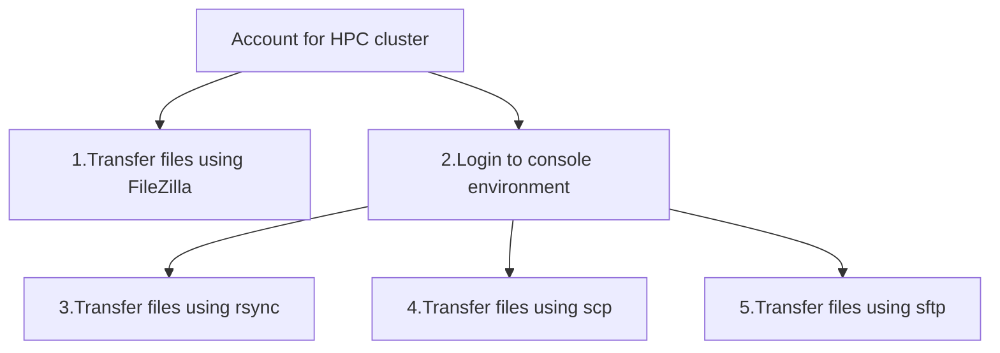

---
tags:
  - session
  - lesson
  - intro
  - introduction
  - overview
---

# Introduction

## Overview

Here is an overview of the sessions and their relations:

As per [prerequisites](../prereqs/README.md):

- you already have an account at an HPC cluster
- you can already log in to a console environment at your HPC cluster
  using SSH

Here is an overview of the file transfer tools in this course:

Tool       |Features
-----------|-----------------------------------------------------------
FileZilla  |Graphical, intuitive, simple
`rsync`    |Terminal, powerful, flexible, feels like a regular file copy
`scp`      |Terminal, simple, feels like a regular file copy
`sftp`     |Terminal, simple, feels like a file transfer portal

