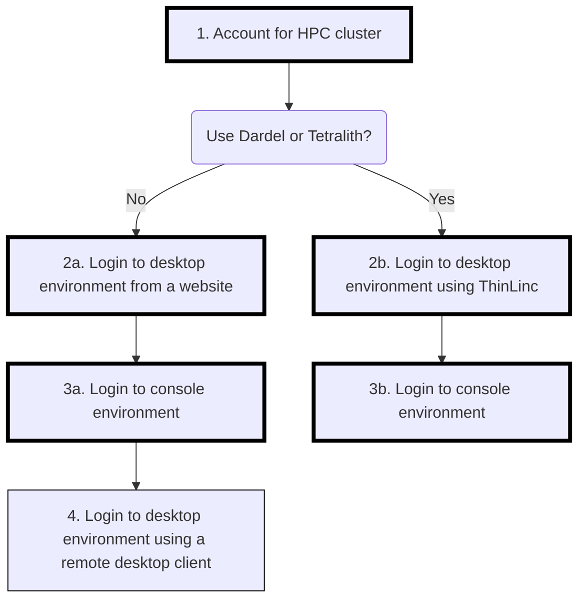
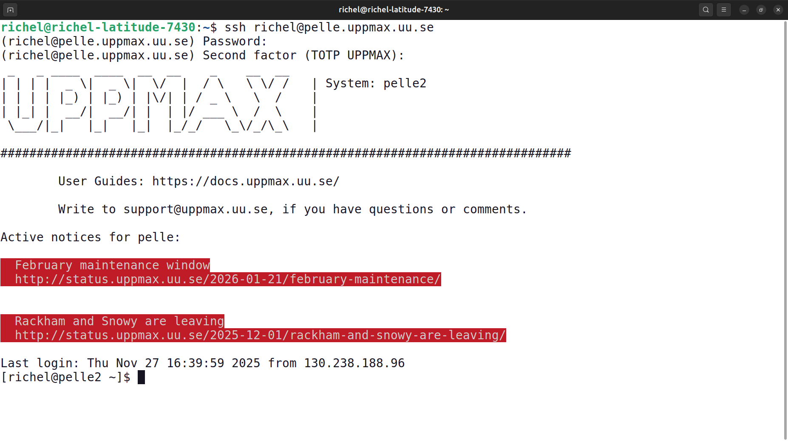

---
tags:
  - session
  - lesson
  - intro
  - introduction
  - overview
---

# Introduction 'Connect'

!!!- info "Learning outcomes"

    - Can find an overview of the course
    - Can find the [schedule](../../schedule.md)
    - Have seen the ways to connect at this course
    - Have seen where to put
      [anonymous feedback during the day](../../evaluation.md#any-feedback-during-the-day)
    - Have included HPC cluster name in Zoom username,
      e.g. `[Dardel] Sven Svensson`

???- question "For teachers"

    Teaching goals are:

    - Learners can find an overview of the course
    - Learners can find the [schedule](../../schedule.md)
    - Learners have seen the ways to connect at this course
    - Learners have seen where to put
      [anonymous feedback during the day](../../evaluation.md#any-feedback-during-the-day)
    - Learners have included their HPC cluster name in Zoom username

    Prior questions:

    - What is a file tranfer?
    - What does one need to do, to be able to do a file transfer?
    - How does it look like to do a file transfer?
    - Can you name some programs that can do file transfer?

## Overview

Below an overview of the sessions and their relations.
The optional sessions have thinner borders.

As per [prerequisites](../../prereqs/README.md):

- you already have an account at an HPC cluster

Here is an overview of the ways to login in this course:

<!-- markdownlint-disable MD013 --><!-- Tables cannot be split up over lines, hence will break 80 characters per line -->

Feature                                | Desktop, web browser                            | Console                             | Desktop, remote desktop client
---------------------------------------|-------------------------------------------------|-------------------------------------|----------------------------------------
Example screenshot                     | |              |
Summary                                | Familiar to most                                | Less familiar to most               | Familiar to most
Type of user interface                 | Graphical                                       | Terminal                            | Graphical
Installation needed?                   | Unlikely                                        | Likely                              | Most likely
Program used                           | Any web browser                                 | Any SSH agent                       | ThinLinc, Remmina, `krdp`
Course session                         |[Session](../login_desktop_web_browser/README.md)|[Session](../login_console/README.md)|[Session](../login_desktop_remote_desktop_client/README.md)

<!-- markdownlint-enable MD013 -->

Here is an overview of the documentation pages for each HPC center:

<!-- markdownlint-disable MD013 --><!-- Tables cannot be split up over lines, hence will break 80 characters per line -->

HPC Cluster|Documentation
-----------|------------
Alvis      |[Documentation](https://www.c3se.chalmers.se)
Berzelius  |[Documentation](https://www.nsc.liu.se)
Bianca     |[Documentation](https://docs.uppmax.uu.se)
COSMOS     |[Documentation](https://lunarc-documentation.readthedocs.io)
Dardel     |[Documentation](https://menzzana.github.io/NAISS-support-web/dardel/login/login/)
Kebnekaise |[Documentation](https://docs.hpc2n.umu.se/)
LUMI       |[Documentation](https://docs.csc.fi)
Pelle      |[Documentation](https://docs.uppmax.uu.se)
Rackham    |[Documentation](https://docs.uppmax.uu.se)
Tetralith  |[Documentation](https://www.nsc.liu.se)
Vera       |[Documentation](https://www.c3se.chalmers.se)

<!-- markdownlint-enable MD013 -->

## Exercises

### Exercise 0: rename yourself

Please change your Zoom name to start with your HPC cluster,
e.g. `Sven [Rackham]`. Put your name first: it is the more important
information here :-)

### Exercise 1: remember a Zoom room

We will use breakout rooms, as this is best for learning.
Ideally, each breakout room has 2 learners for the same HPC cluster.

HPC cluster name  |Main breakout room
------------------|------------------
Alvis silent      |Room 1
Alvis group       |Room 2
Bianca silent     |Room 3
Bianca group      |Room 4
COSMOS silent     |Room 5
COSMOS group      |Room 6
Dardel silent     |Room 7
Dardel group      |Room 8
Kebnekaise silent |Room 9
Kebnekaise group  |Room 10
Pelle silent      |Room 11
Pelle group       |Room 12
Tetralith silent  |Room 13
Tetralith group   |Room 14
Other silent      |Room 15
Other group       |Room 16

- When your first breakout room reaches 4 learners, decide upon 2 to
  move to the next breakout room.
  Repeat until the group size is below 4.
- When you are the only one in your main breakout room,
  the teachers will let you decide to either work in silence or
  to join another group. You will be taken care of well :-)
