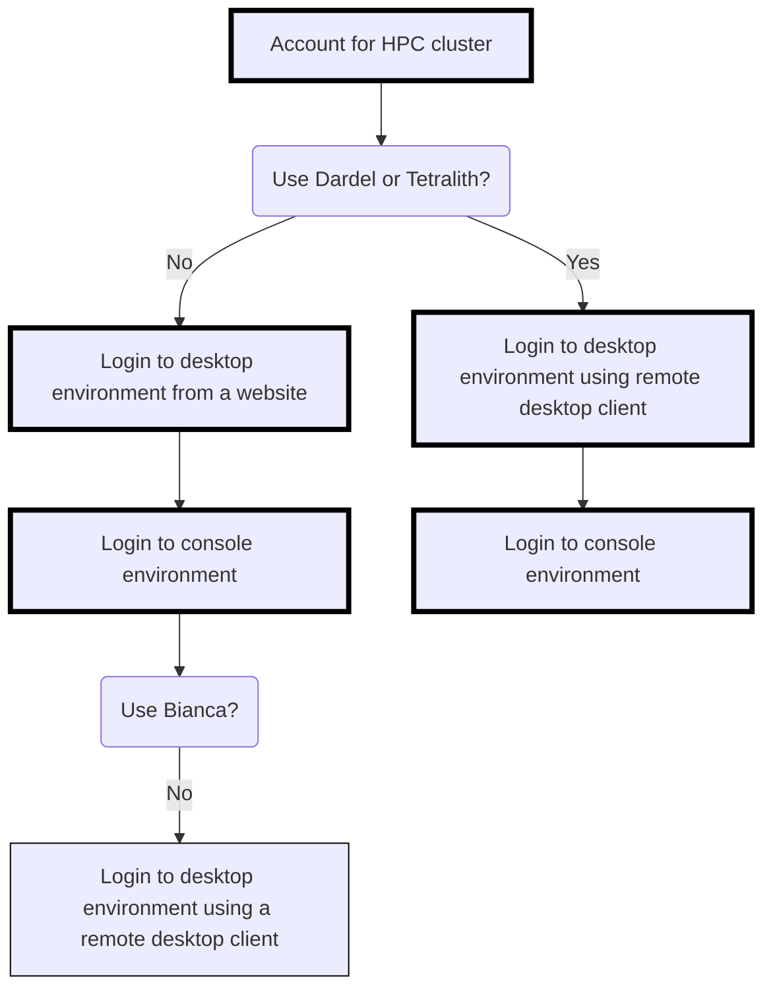

---
tags:
  - session
  - lesson
  - intro
  - introduction
  - overview
---

# Introduction 'Connect'

!!!- info "Learning outcomes"

    - Can find an overview of the course
    - Can find the [schedule](../../schedule.md)
    - Have seen the ways to connect at this course
    - Have seen where to put
      [anonymous feedback during the day](../../evaluation.md#any-feedback-during-the-day)
    - Have included HPC cluster name in Zoom username,
      e.g. `Sven Svensson [Dardel]`

???- question "For teachers"

    Teaching goals are:

    - Learners can find an overview of the course
    - Learners can find the [schedule](../../schedule.md)
    - Learners have seen the ways to connect at this course
    - Learners have seen where to put
      [anonymous feedback during the day](../../evaluation.md#any-feedback-during-the-day)
    - Learners have included their HPC cluster name in Zoom username

    Prior questions:

    - What is a file tranfer?
    - What does one need to do, to be able to do a file transfer?
    - How does it look like to do a file transfer?
    - Can you name some programs that can do file transfer?

## The multiple ways to connect to your HPC cluster

You have an account at an HPC cluster
([a prerequisite for this course](../../prereqs/README.md))
and you want to connect to your HPC cluster.

There are multiple ways to do so!

Here is an overview of the ways to login in this course:

<!-- markdownlint-disable MD013 --><!-- Tables cannot be split up over lines, hence will break 80 characters per line -->

Feature                                | Desktop environment using a web browser         | Console environment                 | Desktop environment using a remote desktop client
---------------------------------------|-------------------------------------------------|-------------------------------------|--------------------------------------------------
Example screenshot                     | |              |
Environment                            | Desktop environment                             | Console environment                 | Desktop environment
Summary                                | Familiar to most                                | Less familiar to most               | Familiar to most
Type of user interface                 | Graphical                                       | Terminal                            | Graphical
Installation needed?                   | Unlikely                                        | Likely                              | Most likely
Program used                           | A web browser                                   | An SSH agent                        | A remote desktop client
Example programs                       | Firefox, Chromium, Chrome, Edge, Safari         | Terminal, MobaXterm                 | ThinLinc, Remmina, `krdp`
Works on which clusters?               | All except Dardel and Tetralith                 | All                                 | All, except Bianca
Course session                         |[Session](../login_desktop_web_browser/README.md)|[Session](../login_console/README.md)|[Session](../login_desktop_remote_desktop_client/README.md)

<!-- markdownlint-enable MD013 -->

## Exercises

### Exercise 0: rename yourself

Please change your Zoom name to start with your HPC cluster,
e.g. `Sven [Rackham]`. Put your name first: it is the more important
information here :-)

### Exercise 1: remember a Zoom room

We will use breakout rooms, as this is best for interaction and learning.
Pick your favorite room, depending on yout HPC cluster and if you prefer
to work in silence.

HPC cluster name  |Main breakout room
------------------|------------------
Alvis silent      |Room 1
Alvis group       |Room 2
Bianca silent     |Room 3
Bianca group      |Room 4
COSMOS silent     |Room 5
COSMOS group      |Room 6
Dardel silent     |Room 7
Dardel group      |Room 8
Kebnekaise silent |Room 9
Kebnekaise group  |Room 10
Pelle silent      |Room 11
Pelle group       |Room 12
Tetralith silent  |Room 13
Tetralith group   |Room 14
Other silent      |Room 15
Other group       |Room 16
Any, free to use  |Any other room

Feel free to move as a singleton or duo if you want to interact with
your peers or the teachers!

The teachers will come to the group rooms and split the group up in duos,
as this is best for learning. It is most fun too!

### Exercise 2: find your first session

Not all HPC clusters can do all

Below an overview of the sessions and their relations.
The optional sessions have thinner borders.

> Decision tree.
> Links to the sessions are found in the table below.

HPC Cluster|First session                                                                           |Second session                                               |Third session
-----------|----------------------------------------------------------------------------------------|-------------------------------------------------------------|------------------------------------------------------------------------------------
Alvis      |[Login using a web browser](../login_desktop_web_browser/README.md)                     |[Login to a console environment](../login_console/README.md) |[Login using a remote desktop client](../login_desktop_remote_desktop_client/README.md)
Berzelius  |[Login using a web browser](../login_desktop_web_browser/README.md)                     |[Login to a console environment](../login_console/README.md) |[Login using a remote desktop client](../login_desktop_remote_desktop_client/README.md)
Bianca     |[Login using a web browser](../login_desktop_web_browser/README.md)                     |[Login to a console environment](../login_console/README.md) |None
COSMOS     |[Login using a web browser](../login_desktop_web_browser/README.md)                     |[Login to a console environment](../login_console/README.md) |[Login using a remote desktop client](../login_desktop_remote_desktop_client/README.md)
Dardel     |[Login using a remote desktop client](../login_desktop_remote_desktop_client/README.md) |[Login to a console environment](../login_console/README.md) |None
Kebnekaise |[Login using a web browser](../login_desktop_web_browser/README.md)                     |[Login to a console environment](../login_console/README.md) |[Login using a remote desktop client](../login_desktop_remote_desktop_client/README.md)
LUMI       |[Login using a web browser](../login_desktop_web_browser/README.md)                     |[Login to a console environment](../login_console/README.md) |[Login using a remote desktop client](../login_desktop_remote_desktop_client/README.md)
Pelle      |[Login using a web browser](../login_desktop_web_browser/README.md)                     |[Login to a console environment](../login_console/README.md) |[Login using a remote desktop client](../login_desktop_remote_desktop_client/README.md)
Rackham    |[Login using a web browser](../login_desktop_web_browser/README.md)                     |[Login to a console environment](../login_console/README.md) |[Login using a remote desktop client](../login_desktop_remote_desktop_client/README.md)
Tetralith  |[Login using a remote desktop client](../login_desktop_remote_desktop_client/README.md) |[Login to a console environment](../login_console/README.md) |None
Vera       |[Login using a web browser](../login_desktop_web_browser/README.md)                     |[Login to a console environment](../login_console/README.md) |[Login using a remote desktop client](../login_desktop_remote_desktop_client/README.md)

<!-- markdownlint-enable MD013 -->

Done?

Then it is time to [start your first file transfer](https://uppmax.github.io/naiss_file_transfer_course/sessions/intro_file_transfer/) :-) !
