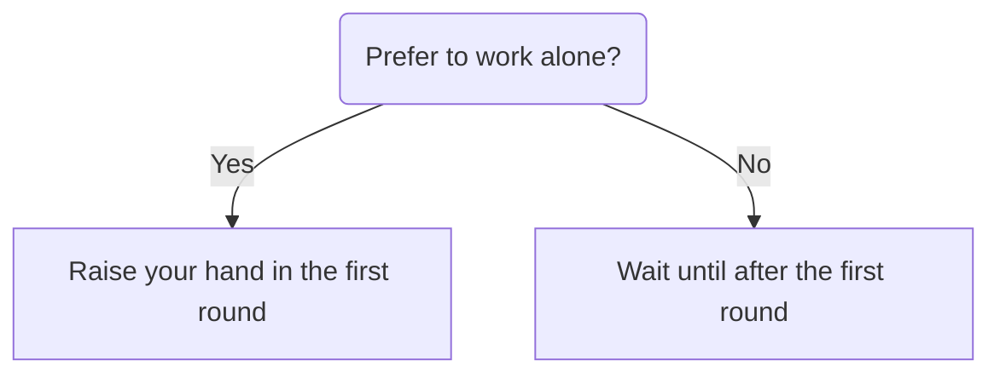
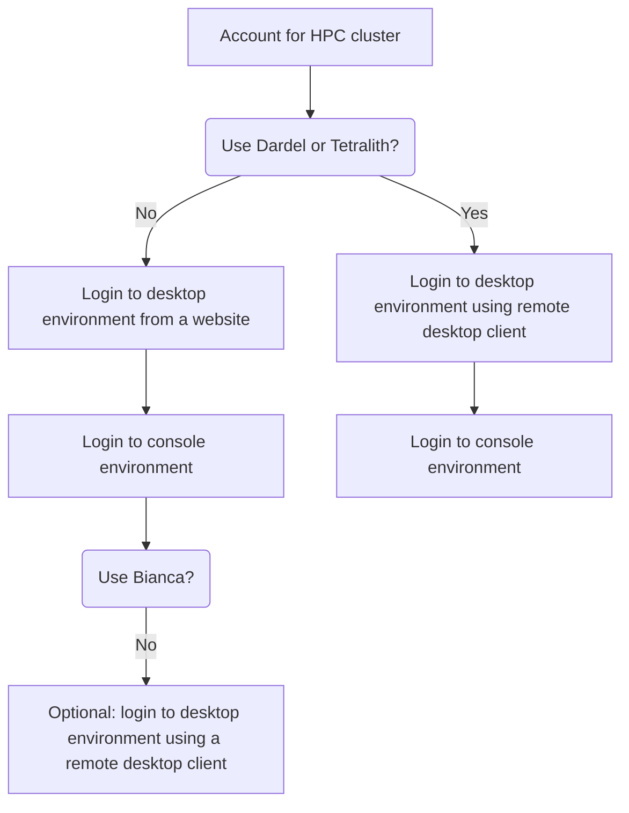

---
tags:
  - session
  - lesson
  - intro
  - introduction
  - overview
---

# Introduction 'Connect'

!!!- info "Learning outcomes"

    - Can find an overview of the course
    - Can find the [schedule](../../schedule.md)
    - Have seen the ways to connect at this course
    - Have seen where to put
      [anonymous feedback during the day](../../evaluation.md#any-feedback-during-the-day)
    - Have included HPC cluster name in Zoom username,
      e.g. `[Dardel] Sven Svensson`

???- question "For teachers"

    Teaching goals are:

    - Learners can find an overview of the course
    - Learners can find the [schedule](../../schedule.md)
    - Learners have seen the ways to connect at this course
    - Learners have seen where to put
      [anonymous feedback during the day](../../evaluation.md#any-feedback-during-the-day)
    - Learners have included their HPC cluster name in Zoom username

    Prior questions:

    - What is a file tranfer?
    - What does one need to do, to be able to do a file transfer?
    - How does it look like to do a file transfer?
    - Can you name some programs that can do file transfer?

## The multiple ways to connect to your HPC cluster

You have an account at an HPC cluster
([a prerequisite for this course](../../prereqs/README.md))
and you want to connect to your HPC cluster.

There are multiple ways to do so!

Here is an overview of the ways to login in this course:

<!-- markdownlint-disable MD013 --><!-- Tables cannot be split up over lines, hence will break 80 characters per line -->

Feature                                | Desktop environment using a web browser         | Console environment                 | Desktop environment using a remote desktop client
---------------------------------------|-------------------------------------------------|-------------------------------------|--------------------------------------------------
Example screenshot                     | |              |
Environment                            | Desktop environment                             | Console environment                 | Desktop environment
Summary                                | Familiar to most                                | Less familiar to most               | Familiar to most
Type of user interface                 | Graphical                                       | Terminal                            | Graphical
Installation needed?                   | Unlikely                                        | Likely                              | Most likely
Program used                           | A web browser                                   | An SSH agent                        | A remote desktop client
Example programs                       | Firefox, Chromium, Chrome, Edge, Safari         | Terminal, MobaXterm                 | ThinLinc, Remmina, `krdp`
Works on which clusters?               | All except Dardel and Tetralith                 | All                                 | All, except Bianca
Course session                         |[Session](../login_desktop_web_browser/README.md)|[Session](../login_console/README.md)|[Session](../login_desktop_remote_desktop_client/README.md)

<!-- markdownlint-enable MD013 -->

## Exercises

### Exercise 1: rename yourself

Please change your Zoom name to start with your HPC cluster,
as `[name_of_hpc_cluster] your_name`, e.g. `[Dardel] Sven Svensson`.

??? question "Why the name of the HPC cluster first?"

    It will make Zoom sort your names in a way most convenient for the course,
    which helps the logistics of the course.

### Exercise 2: be assigned a Zoom room

We will use breakout rooms, as this is best for
interaction and learning. However, some prefer to work alone.
In this course, we allow for both.

For a quick process, we follow the following procedure:

In your breakout rooms, start with the next exercise.

Good luck and enjoy!

### Exercise 3: find your first way to login

Not all HPC clusters can do all ways to login.

Below an overview of the sessions and their relations.

<!-- markdownlint-disable MD013 --><!-- Mermaid diagrams cannot be split up over lines, hence will break 80 characters per line -->

<!-- markdownlint-enable MD013 -->

> Decision tree to find out which sessions to follow in which order.
> The same information is shown in the table below.

<!-- markdownlint-disable MD013 --><!-- Tables cannot be split up over lines, hence will break 80 characters per line -->

HPC Cluster|First session                                                                           |Second session                                               |Third session
-----------|----------------------------------------------------------------------------------------|-------------------------------------------------------------|------------------------------------------------------------------------------------
Alvis      |[Login using a web browser](../login_desktop_web_browser/README.md)                     |[Login to a console environment](../login_console/README.md) |(optional) [Login using a remote desktop client](../login_desktop_remote_desktop_client/README.md)
Berzelius  |[Login using a web browser](../login_desktop_web_browser/README.md)                     |[Login to a console environment](../login_console/README.md) |(optional) [Login using a remote desktop client](../login_desktop_remote_desktop_client/README.md)
Bianca     |[Login using a web browser](../login_desktop_web_browser/README.md)                     |[Login to a console environment](../login_console/README.md) |None
COSMOS     |[Login using a web browser](../login_desktop_web_browser/README.md)                     |[Login to a console environment](../login_console/README.md) |(optional) [Login using a remote desktop client](../login_desktop_remote_desktop_client/README.md)
Dardel     |[Login using a remote desktop client](../login_desktop_remote_desktop_client/README.md) |[Login to a console environment](../login_console/README.md) |None
Kebnekaise |[Login using a web browser](../login_desktop_web_browser/README.md)                     |[Login to a console environment](../login_console/README.md) |(optional) [Login using a remote desktop client](../login_desktop_remote_desktop_client/README.md)
LUMI       |[Login using a web browser](../login_desktop_web_browser/README.md)                     |[Login to a console environment](../login_console/README.md) |(optional) [Login using a remote desktop client](../login_desktop_remote_desktop_client/README.md)
Pelle      |[Login using a web browser](../login_desktop_web_browser/README.md)                     |[Login to a console environment](../login_console/README.md) |(optional) [Login using a remote desktop client](../login_desktop_remote_desktop_client/README.md)
Rackham    |[Login using a web browser](../login_desktop_web_browser/README.md)                     |[Login to a console environment](../login_console/README.md) |(optional) [Login using a remote desktop client](../login_desktop_remote_desktop_client/README.md)
Tetralith  |[Login using a remote desktop client](../login_desktop_remote_desktop_client/README.md) |[Login to a console environment](../login_console/README.md) |None
Vera       |[Login using a web browser](../login_desktop_web_browser/README.md)                     |[Login to a console environment](../login_console/README.md) |(optional) [Login using a remote desktop client](../login_desktop_remote_desktop_client/README.md)

<!-- markdownlint-enable MD013 -->

Done?

Then it is time to
[start your first file transfer](https://uppmax.github.io/naiss_file_transfer_course/sessions/intro_file_transfer/)
:-) !
